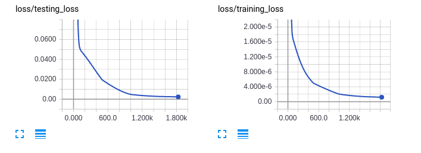
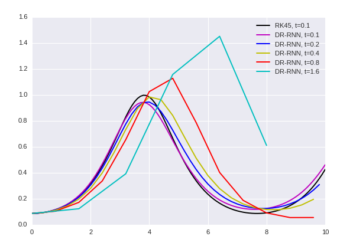
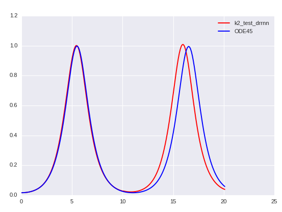
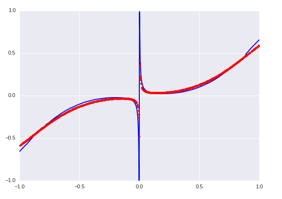
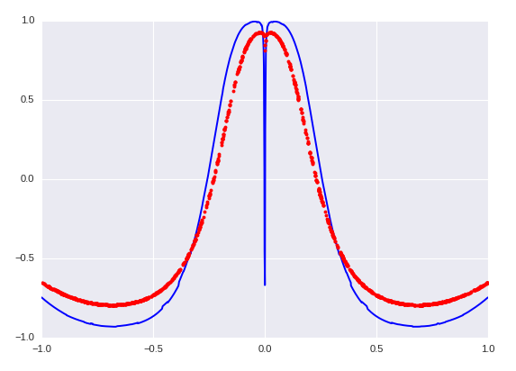

# DR_RNN in Tensorflow

Tensorflow implementation of [DR-RNN: A deep residual recurrent neural network for model reduction](https://arxiv.org/abs/1709.00939).

# Result
Reproduced result of Fig.2 from [the paper](https://arxiv.org/abs/1709.00939)

Results for increasing time steps in DR-RNN

Extrapolation in time, from 10s to 20s.
iter:744  train_cost: 1.49850947651e-07  test_cost: 0.00102584168781
extrapolation of y1

Sensitivity analysis. Partial derivative of predicted y w.r.t. x.

> This result is obtained from DR_RNN_2, at iter:1300, when train_cost=1.52661107222e-06 and test_cost=0.00327986711636

# Todo
- [x] extrapolation in time
- [x] larger time step
- [ ] scalability with y
- [ ] include mapping from x to y
- [x] compute sensitivity w.r.t x for control purpose
- [ ] adding external loading and see if it is predictable given observation in y
- [ ] partial observed
- [ ] Direct Acyclic Graph and Bayesian